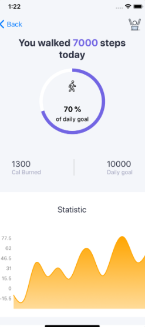
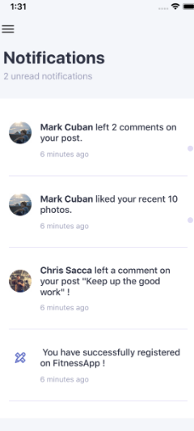
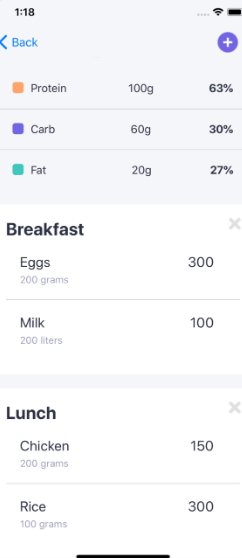
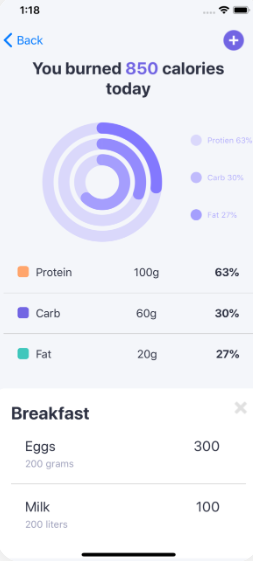
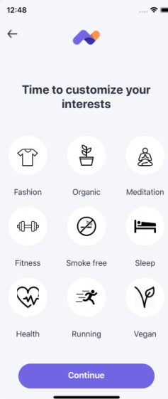
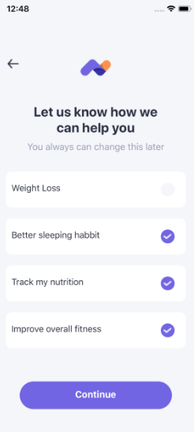
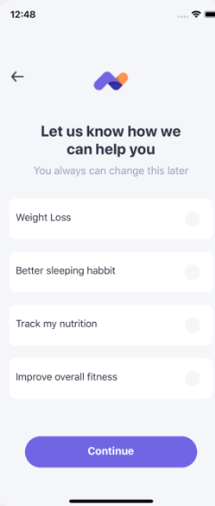
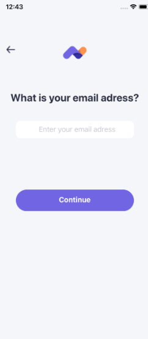

## 🚀 Introduction

The **FuelWell Fitness App** is designed to help users stay consistent with their fitness routines.  
It provides an all-in-one solution to track workouts, log exercises, monitor progress, and stay motivated.

Built with **React Native**, **TypeScript**, and **Expo**, this app delivers a smooth and fast mobile experience across both Android and iOS devices.

### ✨ Key Highlights

- 🧠 **Personalized Workouts:** Create and manage custom workout plans.
- 📊 **Progress Tracking:** Visualize your fitness journey with charts and stats.
- 🔔 **Daily Reminders:** Stay consistent with push notifications and goal tracking.
- 🌙 **Modern UI:** Clean, minimal design using Tailwind CSS & Moti animations.
- 🏃 **Real-Time Updates:** Track sets, reps, calories, and more — live.
- 📅 **Workout Scheduler:** Plan your weekly training sessions easily.

  
## 📸 Some sample screenshots Screenshots

---

## ⚙️ Tech Stack

### 🧩 Frontend
- React Native + Expo  
- TypeScript  
- React Navigation  
- Redux Toolkit / Zustand for State Management  
- Moti / Reanimated for Animations  
- Tailwind CSS (NativeWind)

### 🗄️ Backend
- Node.js + Express.js  
- MongoDB  
- JWT Authentication  
